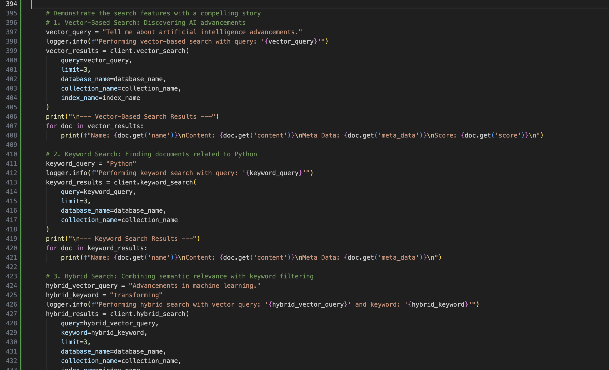

# mdb_toolkit



# Less Code, More Power  

MongoDB's flexibility and PyMongo's robust driver make it a popular choice for database management in Python applications. While PyMongo's `MongoClient` class provides rich functionality, there are scenarios where adding custom methods can simplify repetitive tasks or enhance the developer experience. 

---  
      
### **Why Customize MongoClient?**
- **Streamlined Operations**: Simplify frequent tasks like listing databases and collections.
- **Encapsulation**: Abstract additional functionality into a single, reusable class.
- **Extensibility**: Add new methods to tailor MongoDB operations to your project’s needs.

---

### **Setting Up the Environment**
Before diving into code, we’ll need a MongoDB instance to work with. A simple command to start a local MongoDB container:

```bash
docker run -d -p 27017:27017 --restart unless-stopped mongodb/mongodb-atlas-local
```

---

Integrating advanced search capabilities into your applications can often be complex and time-consuming. However, our latest MongoDB integration changes the game by **streamlining the process, reducing the amount of code you need to write, and making embedding effortless**. 

#### **1. Effortless Embedding Integration**
Embedding AI functionalities into your MongoDB database has never been simpler. Our custom `MongoClient` handles the generation and storage of embeddings seamlessly. This means you can focus on building features rather than managing the intricacies of embedding processes.

#### **2. Clean and Maintainable Codebase**
Say goodbye to cluttered and hard-to-maintain code! Our implementation consolidates essential operations—like creating search indexes, inserting documents with embeddings, and performing various types of searches—into a single, well-organized class. This not only reduces the number of lines you need to write but also enhances the readability and maintainability of your code.

#### **3. Versatile Search Capabilities**
Whether you need vector-based searches, keyword searches, or a combination of both, our integration has you covered. The `vector_search`, `keyword_search`, and `hybrid_search` methods provide flexible options to retrieve the most relevant documents efficiently. This versatility ensures that you can meet a wide range of search requirements with ease.

#### **4. Robust and Reliable Performance**
Built on MongoDB’s solid infrastructure, our client ensures reliable performance from index creation to search execution. With comprehensive logging and error handling, you can trust that your searches will run smoothly and any issues will be promptly identified and addressed.

#### **5. Quick and Easy Deployment**
Configuration is a breeze with support for environment variables and seamless integration with OpenAI’s embedding API. Whether you’re deploying locally or scaling up in the cloud, our setup is designed to fit effortlessly into your existing workflow, allowing you to get started quickly without unnecessary hassle.

---
---

## Output

```
INFO:__main__:Found existing index 'vector_search_index_1'.
INFO:__main__:Search index 'vector_search_index_1' already exists in collection 'test_collection'.
INFO:__main__:Waiting for the search index to be READY...
INFO:__main__:Search index 'vector_search_index_1' is READY.
INFO:__main__:Search index 'vector_search_index_1' is now READY and available!
Index is ready!
INFO:__main__:Collection 'test_collection' already has data. Skipping document insertion.
INFO:__main__:Performing vector-based search with query: 'Tell me about artificial intelligence advancements.'
INFO:httpx:HTTP Request: POST https://api.openai.com/v1/embeddings "HTTP/1.1 200 OK"
INFO:__main__:Found existing index 'vector_search_index_1'.
INFO:__main__:Vector search completed. Found 3 documents.

--- Vector-Based Search Results ---
Name: Document 1
Content: OpenAI develops artificial intelligence technologies.
Meta Data: {'category': 'AI', 'tags': ['openai', 'ai', 'technology']}
Score: 0.7991563081741333

Name: Document 4
Content: Artificial intelligence and machine learning are transforming industries.
Meta Data: {'category': 'AI', 'tags': ['ai', 'machine learning', 'transformation']}
Score: 0.7392491102218628

Name: Document 5
Content: OpenAI's ChatGPT is a language model for generating human-like text.
Meta Data: {'category': 'AI', 'tags': ['openai', 'chatgpt', 'language model']}
Score: 0.6569141149520874

INFO:__main__:Performing keyword search with query: 'Python'
INFO:__main__:Keyword search completed. Found 1 documents.

--- Keyword Search Results ---
Name: Document 3
Content: Python is a versatile programming language.
Meta Data: {'category': 'Programming', 'tags': ['python', 'programming', 'language']}

INFO:__main__:Performing hybrid search with vector query: 'Advancements in machine learning.' and keyword: 'transforming'
INFO:httpx:HTTP Request: POST https://api.openai.com/v1/embeddings "HTTP/1.1 200 OK"
INFO:__main__:Found existing index 'vector_search_index_1'.
INFO:__main__:Hybrid search completed. Found 1 documents.

--- Hybrid Search Results ---
Name: Document 4
Content: Artificial intelligence and machine learning are transforming industries.
Meta Data: {'category': 'AI', 'tags': ['ai', 'machine learning', 'transformation']}
Score: 0.7872726321220398
```
